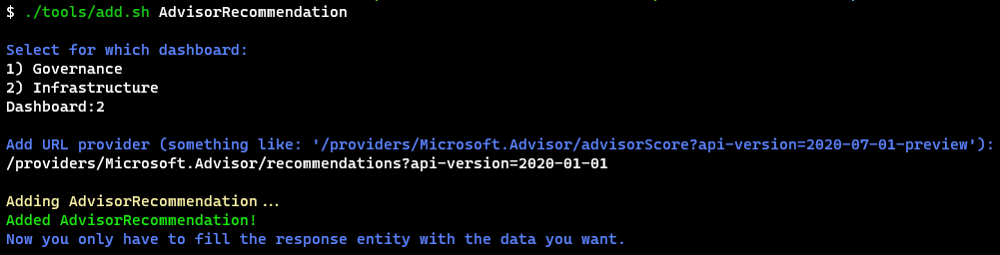

# CCOInsights backend

Azure Governance, Risk and Compliance Team

## Solution Layout

This solution is composed by 3 projects:

- CCOInsights.SubscriptionManager.Functions: Functions to manage the subscriptions and the data lake.
- CCOInsights.SubscriptionManager.Generator: A tool to generate the functions and entities.
- CCOInsights.SubscriptionManager.UnitTests: Unit tests for the functions.

### CCOInsights.SubscriptionManager.Functions

In this project you will find the functions to manage the subscriptions and the data lake. This is the main project of the solution, it contains the functions to get the data from the providers and store it in the data lake. All the functions are triggered by a timer and they are executed every 24 hours. It's designed using Azure Durable Functions, so it can be scaled out.
Every function has a folder with the same name, they are located inside the ```Operations``` folder, inside this folder you will find:

- Function: The function itself.
- Provider: The provider to get the data from the service.
- Response: The response message obtained by the cloud provider.
- Updater: The updater to update the data lake with the new data.
- Entity: The data model that will be stored in the data lake.

In some folders you will find that we have only 3 files: Function, Entity and Response. This is because the provider and the updater are generated at compile time use the tool ```CCOInsights.SubscriptionManager.Generator```. This tool is used to generate the provider and the updater based on the response message. The tool is executed every time the solution is compiled, and is used in some "generic" scenarios that they don't need a most concrete version of the updater or provider. For activate this tool, you need to add the ```GenerateProvider``` attribute to the Response class with the url template as a parameter of this attribute.

### Workflow of the functions

How it works:

At application startup There is an ```OperationScanner``` that scans all the functions and creates some list of operations filtered by their category. There are 3 classified by Their ```DashboardType```, this categories are:

- ```DashboardType.Common```: That functions are executed always because they are common for the two categories.
- ```DashboardType.Infrastructure```: That functions are executed only if the feature ```InfrastructureDashboard``` is enabled.
- ```DashboardType.Governance```: That functions are executed only if the feature ```GovernanceDashboard``` is enabled.

For qualify a function in one category, you need to add the attribute ```OperationDescriptor``` with the type of the dashboard as a parameter of this attribute, and the functionName, like this:

``` csharp
  [OperationDescriptor(DashboardType.Infrastructure, nameof(MyCoolFunction))]
    public class MyCoolFunction : IOperation
    {
        ...

        [FunctionName(nameof(MyCoolFunction))]
        public async Task Execute([ActivityTrigger] IDurableActivityContext context, CancellationToken cancellationToken = default)
        {
            var subscriptions = await _authenticatedResourceManager.Subscriptions.ListAsync(cancellationToken: cancellationToken);
            await subscriptions.AsyncParallelForEach(async subscription =>
                await _updater.UpdateAsync(subscription, cancellationToken), 1);
        }
        ...
    }
```

All the functions have a common interface ```IOperation``` that ensures the standarization of the function itself.

## Setup local Development environment

You need to install the following tools:

- dotnet sdk 6.
- Azure functions sdk 4.
- vscode or visual studio 2022 (we recommend this).

To work locally, create a service principal and give reader permissions to the subscriptions where you want to search.
Then, create a local.settings.json under CCOInsights.SubscriptionManager.Functions.

``` json
{
  "IsEncrypted": false,
  "Values": {
    "AzureWebJobsStorage": "UseDevelopmentStorage=true",
    "FUNCTIONS_WORKER_RUNTIME": "dotnet",
    "Environment": "Local",
    "ClientId": "<<ClientId>>",
    "ClientSecret": "<<ClientSecret>>",
    "TenantId": "<<TenantId>>",
    "DataLakeAccountName": "<<DataLakeAccountName>>",
    "Features:InfrastructureDashboard": "true",
    "Features:GovernanceDashboard": "true",
    //"FunctionExclusive": "YourAwesomeFunctionName" //Uncomment this setting with your function name for debug only one function
  }
}
```

Substitute variables with service principal values. By default, all functions are executed, but you can uncomment the ```FunctionExclusive``` setting to execute only one function. By default, the ```InfrastructureDashboard``` and ```GovernanceDashboard``` are enabled, but you can disable them if you want. This is useful if you want to debug only one dashboard.

## How to add new features

To add a new function, you can execute the tool add.

``` sh
  ./tools/add.sh <entity_name>
```



It will prompt you to ask which dashboard is and the provider url. After that, you will have a new folder with the 3 files needed (Function, Entity, Response).

You can start adding your ```Response``` message, and your entity contracts. After that if it's a generic function, you can add the ```GenerateProvider``` attribute to the ```Response``` class with the url template as a parameter of this attribute. If it's not a generic function, you can add the provider and the updater manually.

After that, you can debug and test your function changing your local.settings.json file. Note that you don't need to register nothing in the IoC container, everything is registered automatically by convention.

### Git hooks

It is mandatory to run the following line in the cli the first time you clone the repository in order to apply the team standard hooks. This, will ensure that the code is formatted and the tests are passing before pushing to remote repository.

``` sh
  git config --local core.hooksPath .hooks
```