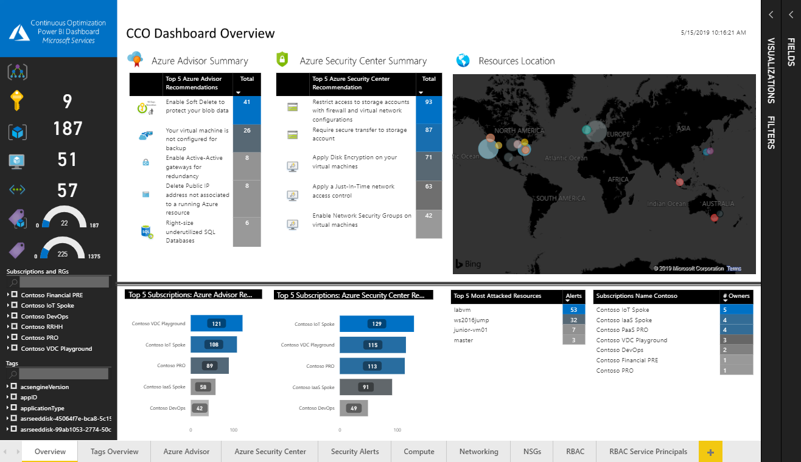

# Continuous Cloud Optimization Insights

- [Continuous Cloud Optimization Insights](#continuous-cloud-optimization-insights)
  - [Overview](#overview)
  - [Release notes](#release-notes)
    - [Highlights of the latest releases](#highlights-of-the-latest-releases)
      - [CCO GitHub Contributions Dashboards Version 1.0](#cco-github-contributions-dashboards-version-10)
      - [CCO ADO Contributions Dashboards Version 1.0](#cco-ado-contributions-dashboards-version-10)
      - [CCO Azure Infrastructure Dashboard Version 9.1 Updates](#cco-azure-infrastructure-dashboard-version-91-updates)
      - [CCO Azure Governance Dashboard Version 2.6 Updates](#cco-azure-governance-dashboard-version-26-updates)
  - [List of resources](#list-of-resources)
  - [Dashboard overview](#dashboard-overview)
    - [CCO Azure Governance Dashboard Report Pages](#cco-azure-governance-dashboard-report-pages)
    - [CCO Azure Infrastructure Dashboard Report Pages](#cco-azure-infrastructure-dashboard-report-pages)
    - [CCO GitHub Contributions Dashboard](#cco-github-contributions-dashboard)
    - [CCO ADO Contributions Dashboard](#cco-ado-contributions-dashboard)
    - [CCO Azure Infrastructure Dashboard with AKS add-on Report Pages (not maintained)](#cco-azure-infrastructure-dashboard-with-aks-add-on-report-pages-not-maintained)
  - [Call for contribution](#call-for-contribution)

-------------------------------
>**NOTE**:  Watch these informational [videos](https://aka.ms/ccoinsights/videos) for a detailed overview of capabilities, features and installation steps of the CCO Insights solution.

## Overview

The Continuous Cloud Optimization Insights (CCO Insights) project is a set of Power BI Desktop Reports developed using Power Query M language and DAX, that pulls information directly from different Azure REST APIs and enables monitoring, operation and infrastructure teams to quickly gain insights about their existing Azure Platform footprint and resources as well as code contribution characteristics on two major platforms - Azure DevOps and GitHub.

CCO Insights currently includes 5 different dashboards to discover information about your Azure, Azure DevOps and GitHub cloud platforms:

- [**CCO Azure Infrastructure Dashboard**](./dashboards/CCODashboard-Infra/InfraDeploymentGuide.md): Get insights about Azure advisor optimizations, Azure Security Center Alerts, Networking, Compute, RBAC, Idle resources and Subscriptions Quotas and Limits
- [**CCO Azure Governance Dashboard**](./dashboards/CCODashboard-Governance/GovernanceDeploymentGuide.md): Get insights about Azure Governance aspects like Management Groups and Subscriptions hierarchy, resource tagging and naming standards, security controls, policies compliance, Regulatory Standards and Azure Blueprints
- [**CCO Azure Infrastructure Dashboard with AKS (not maintained)**](./dashboards/CCODashboard-Infra/InfraDeploymentGuide.md): Get insights about AKS information
- [**CCO GitHub Contributions Dashboard**](./dashboards/GitHubDashboard-Contributors/GitHubDeploymentGuide.md): Get insights about the contributions to your GitHub project.
- [**CCO Azure DevOps Contributions Dashboard**](./dashboards/ADODashboard-Contributors/ADODeploymentGuide.md): Get insights about the contributions to your Azure DevOps (ADO) project.

>**NOTE**: If you're experiencing problems during the deployment of the dashboards, please check the [Troubleshooting guide](./install/TroubleshootingGuide.md) and the [Github issues](https://github.com/Azure/CCOInsights/issues?q=is%3Aissue) before creating a new one.

## Release notes

For the comprehensive list of release notes, see the [Release notes](./Release-Notes.md) page.

### Highlights of the latest releases

#### CCO GitHub Contributions Dashboards Version 1.0

- Initial release of the CCO GitHub Contributions Dashboard

#### CCO ADO Contributions Dashboards Version 1.0

- Initial release of the CCO ADO Contributions Dashboard

#### CCO Azure Infrastructure Dashboard Version 9.1 Updates

- New report page available for Azure Web Applications.
- Management Group filtering
- **IMPORTANT**: Now it requires the Custom connector (mandatory to retrieve the MGs)

#### CCO Azure Governance Dashboard Version 2.6 Updates

- Governance dashboard policies visuals fix

## List of resources

This project includes the following resources:

1. **install folder**: Includes all the files required to successfully deploy the Dashboard in your environment. The [Deployment Guide](./dashboards/CCODashboard-Governance/GovernanceDeploymentGuide.md) file contains a detailed guidance to install and setup your dashboard including the requirements, what REST APIs are in use, the resource providers that needs to be enabled or what tabs are included as part of the default Dashboard. The [Troubleshooting Guide](./install/TroubleshootingGuide.md) file contains guidance to solve potential issues that you might encounter during the Dashboard deployment. Errors like Power BI regional settings, or Privacy levels will be documented on this document.
2. **queries folder**: Includes the M queries used in the Dashboard to pull data from Azure and Graph REST APIs. This content is for reference purposes to facilitate the Data Model comprehension and to enable contributors to expand the Dashboard capabilities.
3. **docs/assets/pictures folder**: Contains all the images that the Dashboard will use when loading data from Azure. The content of this folder will be dynamic and we will update the repository regularly. Make sure the computer running the Dashboard that has internet access also have access to this URL https://azure.github.io/ccodashboard/assets/pictures
4. **dashboards folder**: This parent folder contains sub folders with different versions of the dashboards of CCO Insights depending on the workloads you want to get report from. We expect to see more versions in the future from community contributions.
    - ***CCODashboard-Infra folder*** has a more generic version of the Dashboard that includes information from Azure Advisor, Azure Security Center, Azure Networking REST APIs, Azure Compute REST APIs and Graph
    - ***CCODashboard-Governance folder*** has a dashboard aligned with the Microsoft Cloud Adoption Framework governance principles and will allow to get quick insights around Management Groups, Subscriptions, Blueprints, Polices, Naming Standards, Tagging and Regulatory Standards compliance. For this dashboard is needed the installation of a [custom connector](./dashboards/CCODashboard-Governance/GovernanceDeploymentGuide.md#installing-the-custom-connector).
    - ***CCODashboard-AKS folder*** has the add-on report to monitor Azure Kubernetes Services.

## Dashboard overview
### CCO Azure Governance Dashboard Report Pages

Version 2.6 of the CCO Power BI Dashboard Governance includes the following information:

- [Azure Management Groups and Subscriptions hierarchy](./dashboards/CCODashboard-Governance/GovernanceDeploymentGuide.md#management-groups-and-subscriptions-hierarchy-overview-page)
- [Tags and naming standards page](./dashboards/CCODashboard-Governance/GovernanceDeploymentGuide.md#tags-and-naming-standards-page)
- [Azure Regulatory Standards Forecast](./dashboards/CCODashboard-Governance/GovernanceDeploymentGuide.md#azure-regulatory-standards-forecast)
- [Azure Security and Compliance](./dashboards/CCODashboard-Governance/GovernanceDeploymentGuide.md#azure-resources-security--compliance-page)
- [Azure Policies](./dashboards/CCODashboard-Governance/GovernanceDeploymentGuide.md#azure-policies-page)
- [Azure Blueprints](./dashboards/CCODashboard-Governance/GovernanceDeploymentGuide.md#azure-blueprints-page)

You can find more details about each page in the [Deployment Guide](./dashboards/CCODashboard-Governance/GovernanceDeploymentGuide.md).

### CCO Azure Infrastructure Dashboard Report Pages

The version 9.1 of the CCO Power BI Dashboard includes 10 report pages. You will be able to navigate, filter and report the following information:

- Page 1: [Overview](./dashboards/CCODashboard-Infra/InfraDeploymentGuide.md#cco-azure-infrastructure-dashboard-overview-page)
- Page 2: [Azure Advisor Recommendations](./dashboards/CCODashboard-Infra/InfraDeploymentGuide.md#azure-advisor-recommendations-page)
- Page 3: [Azure Security Center Alerts](./dashboards/CCODashboard-Infra/InfraDeploymentGuide.md#azure-security-center-alerts-page)
- Page 4: [Azure Compute information](./dashboards/CCODashboard-Infra/InfraDeploymentGuide.md#azure-compute-overview-page)
- Page 5: Web Applications (Including function Apps)
- Page 6 [Azure Networking information](./dashboards/CCODashboard-Infra/InfraDeploymentGuide.md#azure-vnets-and-subnets-recommendations-page)
- Page 7: [Network Security Groups](./dashboards/CCODashboard-Infra/InfraDeploymentGuide.md#azure-network-security-groups-page)
- Page 8: [Azure RBAC permissions](./dashboards/CCODashboard-Infra/InfraDeploymentGuide.md#role-based-access-control-page)
- Page 9: [Azure Service Principals RBAC permissions](./dashboards/CCODashboard-Infra/InfraDeploymentGuide.md#service-principal-role-based-access-control-page)
- Page 10: [IaaS Usage and Limits](./dashboards/CCODashboard-Infra/InfraDeploymentGuide.md#iaas-usage-and-limits-page)
- Page 11: [IaaS Idle Resources](./dashboards/CCODashboard-Infra/InfraDeploymentGuide.md#iaas-idle-resources-dashboard-page)

You can find more details about each page in the [Deployment Guide](./dashboards/CCODashboard-Infra/InfraDeploymentGuide.md).

**IMPORTANT**: You must follow [this procedure](https://docs.microsoft.com/en-us/azure/lighthouse/how-to/onboard-customer) to implement Azure delegated resource management to get data from subscriptions in other tenants.

### CCO GitHub Contributions Dashboard

The version 1.0 of the CCO GitHub Contributions Dashboard includes 1 report page. You will be able to navigate, filter and report the following information:
- Number of contributors
- Total number of pull requests
- Number of watchers
- Number of stars
- Number of forks
- Number of clones
- Number of open pull requests
- Average pull requests per day
- Pull requests' lifecycle (in days)
- Comparison between number of open vs closed pull requests over the last months.
- Comparison between number of additions vs deletions per month
- Top contributors measured by changes in their pull requests.

You can find more information about this dashboard in the [Deployment Guide](./dashboards/GitHubDashboard-Contributors/GitHubDeploymentGuide.md).

### CCO ADO Contributions Dashboard

The version 1.0 of the CCO ADO Contributions Dashboard includes 1 report page. You will be able to navigate, filter and report the following information:
- Number of Projects
- Number of open/closed pull requests
- Average pull requests per day
- Comparison between number of open vs closed pull requests over the last months
- Branches created over the last months

You can find more information about this dashboard in the [Deployment Guide](./dashboards/ADODashboard-Contributors/ADODeploymentGuide.md).

### CCO Azure Infrastructure Dashboard with AKS add-on Report Pages (not maintained)

The version 5.0 of the CCO Power BI Dashboard AKS add-on includes the following information:

- Azure Kubernetes Clusters information
- Nodes, Pods, Containers status from Azure Log Analytics
- Azure Container Images (and source repositories) running on AKS Clusters 
- Security recommendations to apply from Azure Security Center 
- Service principals (showing assigned RBAC Roles) with cluster permissions 
- Azure Container Instances information 
- Improved API Rest calls 

## Call for contribution

This project welcomes contributions and suggestions.  Most contributions require you to agree to a
Contributor License Agreement (CLA) declaring that you have the right to, and actually do grant us
the rights to use your contribution. For details, visit https://cla.microsoft.com.

When you submit a pull request, a CLA-bot will automatically determine whether you need to provide
a CLA and decorate the PR appropriately (e.g., label, comment). Simply follow the instructions
provided by the bot. You will only need to do this once across all repos using our CLA.

This project has adopted the [Microsoft Open Source Code of Conduct](https://opensource.microsoft.com/codeofconduct/).
For more information see the [Code of Conduct FAQ](https://opensource.microsoft.com/codeofconduct/faq/) or
contact [opencode@microsoft.com](mailto:opencode@microsoft.com) with any additional questions or comments.
