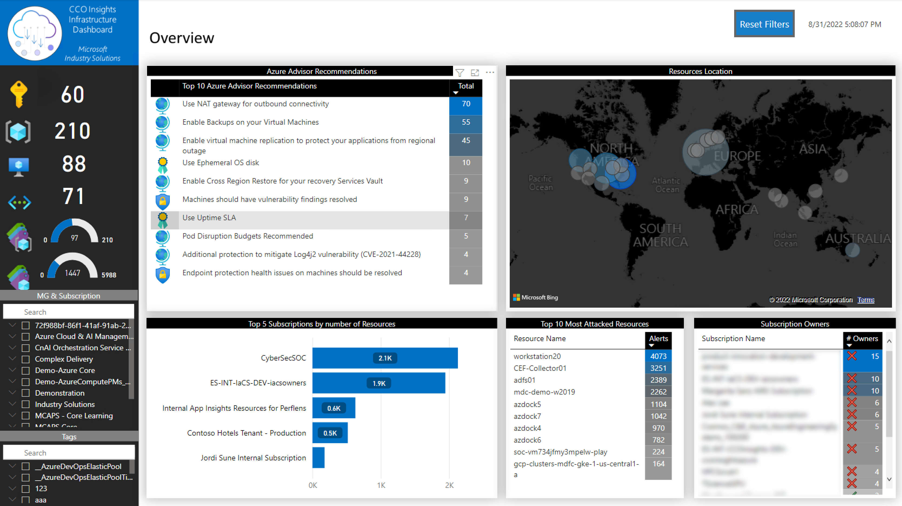

# Continuous Cloud Optimization Insights (CCO Insights)

### _Navigation_

  - [Overview](#overview)
  - [List of dashboard resources](#list-of-dashboard-resources)
  - [CCO Insights Videos](#cco-insights-videos)
  - [Reporting Issues](#reporting-issues)
    - [Bugs](#bugs)
    - [Feature requests](#feature-requests)
  - [Trademarks](#trademarks)
  - [Learn More](#learn-more)

---

# Overview

The Continuous Cloud Optimization Insights (CCO Insights) project is a set of Power BI Desktop Reports developed using Power Query M language and DAX, that pulls information directly from different Azure REST APIs and enables monitoring, operation and infrastructure teams to quickly gain insights about their existing Azure Platform footprint and resources as well as code contribution characteristics on two major platforms - Azure DevOps and GitHub.

CCO Insights currently includes 4 different dashboards to discover information about your Azure, Azure DevOps and GitHub cloud platforms:

- [**CCO Azure Infrastructure Dashboard**](./Deployment%20Guide%20-%20Infrastructure-Dashboard): Get insights about Azure advisor optimizations, Azure Security Center Alerts, Networking, Compute, RBAC, Idle resources and Subscriptions Quotas and Limits
- [**CCO Azure Governance Dashboard**](./Deployment%20Guide%20-%20Governance%20Dashboard): Get insights about Azure Governance aspects like Management Groups and Subscriptions hierarchy, resource tagging and naming standards, security controls, policies compliance, Regulatory Standards and Azure Blueprints
- [**CCO GitHub Contributions Dashboard**](./Deployment%20Guide%20-%20GitHub%20Dashboard): Get insights about the contributions to your GitHub project.
- [**CCO Azure DevOps Contributions Dashboard**](./Deployment%20Guide%20-%20ADO%20Dashboard.md): Get insights about the contributions to your Azure DevOps (ADO) project.

This wiki includes a **Deployment Guide** for each dashboard (see the links above) that contains a detailed guidance on how to install and configure them, including the requirements, what REST APIs are in use, the resource providers that need to be enabled and what tabs are included as part of each dashboard by default. 

The [**Troubleshooting Guide**](./Troubleshooting%20Guide) chapter contains guidance on how to solve potential issues that you might encounter during the dashboards' deployment. Errors like Power BI regional settings, or Privacy levels will be documented in this guide.

# List of assets

1. **queries folder**: Includes the M queries used in the Dashboard to pull data from Azure and Graph REST APIs. This content is for reference purposes to facilitate the Data Model comprehension and to enable contributors to expand the Dashboard capabilities.
2. **docs/assets/pictures folder**: Contains all the images that the Dashboard will use when loading data from Azure. The content of this folder is dynamic and updated regularly. Make sure the computer running the Dashboard also has access to this URL vie the internet: https://azure.github.io/ccodashboard/assets/pictures
3. **dashboards folder**: This folder contains sub folders with different versions of the CCO Insights dashboards.
    - ***CCODashboard-Infra folder*** has a more generic version of the Dashboard that includes information from Azure Advisor, Azure Security Center, Azure Networking REST APIs, Azure Compute REST APIs and Graph
    - ***CCODashboard-Governance folder*** has a dashboard aligned with the Microsoft Cloud Adoption Framework governance principles and will allow to get quick insights around Management Groups, Subscriptions, Blueprints, Polices, Naming Standards, Tagging and Regulatory Standards compliance. For this dashboard is needed the installation of a [custom connector](./Deployment%20Guide%20-%20Governance%20Dashboard#installing-the-custom-connector).

# CCO Insights Videos

To learn more about CCO Insights, see the informational videos on [YouTube](https://aka.ms/ccoinsights/videos) or by **clicking on the thumbnails** below.

||||
|:---:|:---:|:---:|
|| | |
|***Chapter 0* - Introduction**|***Chapter 1* - Setup Power BI Desktop**|**C*hapter 2* - Governance Dashboard**
||||
||||
|***Chapter 3* - Infrastructure Dashboard**|***Chapter 4* - GitHub Dashboard**||

# Reporting Issues

>**NOTE**: If you're experiencing problems during the deployment of the dashboards, please check the [Troubleshooting guide](./Troubleshooting%20Guide) and the [Github closed issues][GitHubClosedIssues] before creating a new one.

## Bugs

If you find any bugs, please file an issue on the [GitHub Issues][GitHubIssues] page by filling out the provided template with the appropriate information.

> Please search the existing issues before filing new issues to avoid duplicates.

If you are taking the time to mention a problem, even a seemingly minor one, it is greatly appreciated, and a totally valid contribution to this project. **Thank you!**

## Feature requests

If there is a feature you would like to see in here, please file an issue or feature request on the [GitHub Issues][GitHubIssues] page to provide direct feedback.

---

# Trademarks

This project may contain trademarks or logos for projects, products, or services. Authorized use of Microsoft trademarks or logos is subject to and must follow
[Microsoft's Trademark & Brand Guidelines](https://www.microsoft.com/en-us/legal/intellectualproperty/trademarks/usage/general).
Use of Microsoft trademarks or logos in modified versions of this project must not cause confusion or imply Microsoft sponsorship.
Any use of third-party trademarks or logos are subject to those third-party's policies.

---

# Learn More

- [Power BI][PowerBIDocs]
- [PowerShell Documentation][PowerShellDocs]
- [Microsoft Azure Documentation][MicrosoftAzureDocs]
- [Azure Resource Manager][AzureResourceManager]
- [Bicep][Bicep]
- [GitHubDocs][GitHubDocs]

<!-- References -->

<!-- Docs -->
[GitHubDocs]: <https://docs.github.com/>
[GitHubIssues]: <https://github.com/Azure/CCOInsights/issues>
[GitHubClosedIssues]: <https://github.com/Azure/CCOInsights/issues?q=is%3Aissue>
[AzureResourceManager]: <https://learn.microsoft.com/en-us/azure/azure-resource-manager/management/overview>
[Bicep]: <https://github.com/Azure/bicep>
[MicrosoftAzureDocs]: <https://learn.microsoft.com/en-us/azure/>
[PowerShellDocs]: <https://learn.microsoft.com/en-us/powershell/>
[PowerBIDocs]: <https://learn.microsoft.com/en-us/power-bi/>
